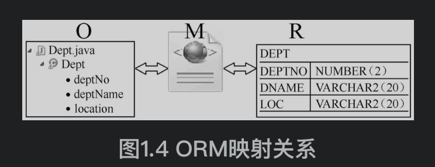

# 定义
### 数据持久化
* 数据持久化是将内存中的数据模型转换为存储模型，以及将存储模型转换为内存中的数据模型的统称。例如，文件的存储、数据的读取等都是数据持久化操作。
* 数据模型可以是任何数据结构或对象模型，存储模型可以是关系模型、XML、二进制流等
### ORM
* 对象/关系映射 (Object/Relational Mapping, ORM)是一种数据持久化技术。它在对象模型和关系型数据库之间建立起对应关系，并且提供了一种机制，通过JavaBean对象操作数据库表中的数据

### 持久化类 POJO
* 持久化类指其实例状态需要被MyBatis持久化到数据库中的类。在应用的设计中持久化类通常对应需求中的业务实体。。MyBatis一般采用POJO(Plain Ordinary Java Object)编程模型来实现持久化类，与POJO类配合完成持久化工作是MyBatis最常见的工作模式。
* POJO 字面上来讲就是普通Java对象。POJO类可以简单地理解为符合JavaBean规范的实体类，它不需要继承和实现任何特殊的Java基类或者接口。JavaBean对象的状态保存在属性中，访问属性必须通过对应的getter和setter方法。