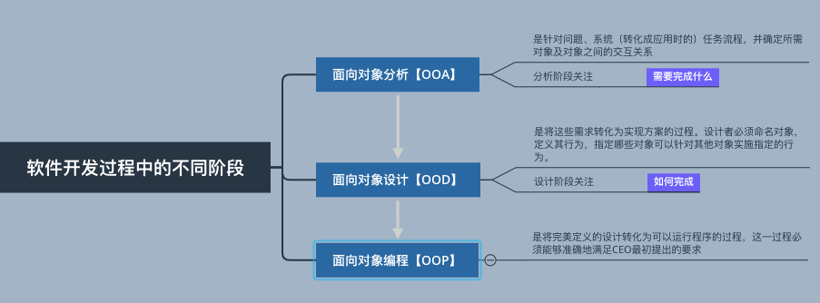

# Python3面向对象编程 第二版
## 第一章 面向对象设计
> 在软件开发中，设计通常被认为是发生在编程之前的步骤，然而这并不是真的。在现实中，分析、编程、与设计是相互重叠、组合、交织在一起的。
### 面向对象意味着什么
#### 对象
* 软件中的对象虽然不是可触摸的实体，也不能被拿到手上感知，但是它是种东西的模型，同样可以做特定的事或者被特定的事物影响。
* 对象是数据和相关行为的集合
> 所谓的“面向”简单来说就是指向，因此面对对象就是功能性的指向对象。这是众多复杂系统建模的技术之一，即通过数据和行为来描述一系列的对象

### 面向对象设计与面向对象编程之间的差异
### 面向对象设计的基本原则
### 基本的统一建模语言（UML）以及在什么情况下它不是那么“邪恶”