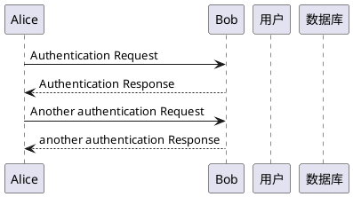
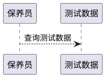
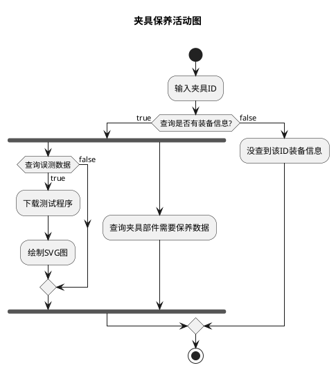

# 518自动测试

```puml
@startuml
Alice -> Bob: Authentication Request
Bob --> Alice: Authentication Response
用户 --
数据库 --

Alice -> Bob: Another authentication Request
Alice <-- Bob: another authentication Response
@enduml
```

```puml
@startuml
保养员 --> 测试数据: 查询测试数据
@enduml
```

### 活动视图

```puml
@startuml
title 夹具保养活动图\n
start
:输入夹具ID;
if (查询是否有装备信息?) then (true)
    fork
        if (查询误测数据) then (true)
            :下载测试程序;
            :绘制SVG图;
         else (false)
         endif
    fork again
        :查询夹具部件需要保养数据;
    end fork
else (false)
:没查到该ID装备信息;
endif
stop
@enduml
```

D8  D11下车